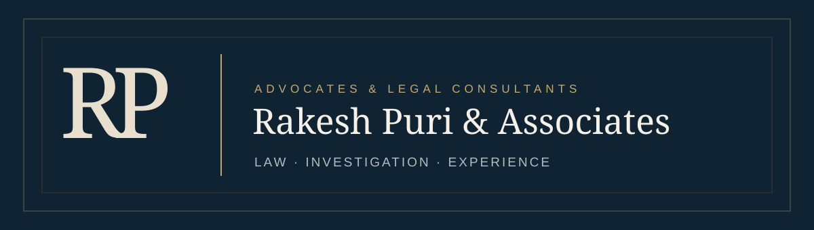

<div align="center">



# Rakesh Puri & Associates

**Advocates & Legal Consultants · Rajasthan, India**

A considered web presence built around **law, investigation, evidence and courtroom advocacy**.

[View the website files](dist/) · [Practice areas](dist/practice-areas/) · [Professional profile](dist/professional-profile/) · [Contact page](dist/contact/)

</div>

---

## § Project at a glance

This repository contains a responsive, multi-page static website for **Rakesh Puri & Associates**. Its content introduces the practice, Rakesh Kumar Puri’s professional background, principal practice areas, courts and forums, and contact information. The visual language uses deep navy, warm ivory, restrained gold and editorial typography.

The website is deliberately informational. It does not promise results, publish testimonials or present an illustrative photograph as a portrait of Rakesh Puri. See [launch notes](LAUNCH_NOTES.md) for the page review and remaining client inputs, and [social bio options](SOCIAL_BIOS.md) for profile copy.

| | What is included |
|---|---|
| 🏛️ **Practice** | Criminal law, constitutional writ matters and the wider practice-area index |
| 📖 **Profile** | Biography, police-service journey, investigation background and education |
| 🧭 **Experience** | Evidence, witnesses, forensic material, trial preparation, courts and forums |
| ✉️ **Contact** | Published telephone number, WhatsApp enquiry handoff and contact page |
| 🔎 **Discovery** | Page titles, descriptions, social preview image, canonical links, JSON-LD, sitemap and robots.txt |
| ♿ **Usability** | Responsive layout, keyboard focus, semantic HTML and reduced-motion support |

## 🗂️ Website pages

| Page | Purpose |
|---|---|
| `/` | Home and practice introduction |
| `/about/` | About the practice |
| `/practice-areas/` | All listed practice areas |
| `/practice-areas/criminal-law/` | Criminal law focus |
| `/practice-areas/writ-jurisdiction/` | Constitutional and writ jurisdiction |
| `/investigation-expertise/` | Investigation and trial-evidence background |
| `/courts-and-forums/` | Client-supplied forum experience |
| `/professional-profile/` | Rakesh Kumar Puri’s profile |
| `/insights/` | Editorial topics awaiting advocate review |
| `/insights/understanding-investigation-records/` | Reserved article page; not published as legal advice |
| `/contact/` | Chambers contact details and enquiry form status |
| `/privacy-policy/`, `/terms/`, `/disclaimer/` | Website information and legal notices |
| `/404/` | Not-found page |

## 🛠️ Run locally

The site uses **Python’s standard library** to generate HTML. It has no application-package installation step.

```bash
# From the repository root
python build.py
python validate.py
python -m http.server 8000 --directory dist
```

Open `http://localhost:8000/` in a browser. If `python` is unavailable on Windows, use an installed Python 3 executable or the `py -3` launcher.

## 🚀 Deploy on Netlify

Connect this repository's `main` branch to Netlify. The root-level [`netlify.toml`](netlify.toml) runs the Python build and validation, then publishes `dist`.

| Netlify build setting | Value |
|---|---|
| Base directory | Leave empty (repository root) |
| Package directory | Leave empty |
| Build command | `python3 build.py && python3 validate.py` |
| Publish directory | `dist` |
| Functions directory | Leave at the default; this site has no functions |
| Build status | Active builds |

After a deploy, Netlify's **Deploy File Explorer** should show `index.html` directly at the top of the published files. If the site displays Netlify's 404 page, check that the project is connected to this repository and the `main` branch, and that the latest deploy succeeded.

### Project structure

```text
.
├── assets/
│   ├── style.css                 # Design and responsive styles
│   ├── main.js                   # Menu, acknowledgement and form status
│   ├── favicon.svg               # RK Puri site icon
│   ├── rajasthan-high-court.jpg  # Licensed court photograph
│   ├── social-card.png            # Open Graph / LinkedIn preview
│   └── readme-banner.svg         # Repository cover art
├── build.py                      # Generates every page and SEO file
├── netlify.toml                  # Netlify build and publish settings
├── validate.py                   # Checks pages, links and structured data
├── LAUNCH_NOTES.md               # Page review and required client approvals
├── SOCIAL_BIOS.md                # Suggested social-profile copy
├── tools/generate_social_card.py # Optional social-image generator
└── dist/                         # Ready-to-serve static output
```

Edit content in `build.py` and styling in `assets/style.css`, then run `python build.py` again. `dist/` is committed so the current site can also be served directly by static hosting.

## 🎨 Design and imagery

The site’s wordmark, large editorial headings and calm palette are intended to suit a senior legal practice. A genuine photograph of the **Rajasthan High Court building in Jodhpur** gives the site local context. It is labelled as court architecture; it is **not** a chambers photograph or a portrait of the advocate.

**Photo credit:** [TrendSPLEND / Wikimedia Commons](https://commons.wikimedia.org/wiki/File:New_Rajasthan_High_Court_Building.jpg), licensed under [CC BY-SA 4.0](https://creativecommons.org/licenses/by-sa/4.0/). The downloaded JPEG is used unchanged. Attribution also appears in the website footer.

The professional-profile portrait area is intentionally reserved for an authentic photograph supplied and approved by Rakesh Kumar Puri.

## 📞 Contact behaviour

- The phone link calls **+91 94144 32758**, the client-supplied professional number.
- The floating green WhatsApp button opens a conversation with that number.
- The floating Contact button opens `/contact/`.
- The enquiry form prepares a WhatsApp link with the entered details. Choosing to continue shares those details with WhatsApp; the visitor then reviews and decides whether to send the chat message. The website does not store form contents.
- An official email address has not yet been approved. The form does not claim to send email.

## ✅ Review before public launch

The following are explicit handoff items, not assumptions to fill in silently:

1. **Verify professional facts:** 35 years of police service, 5,000+ cases investigated or supervised, 300+ commendations, appointments and Bar Council details.
2. **Resolve the chronology:** client-provided **2016 Bar Council enrolment**, **11 years of legal practice**, and **1979 education year/degree formatting** need confirmation together.
3. **Approve the official portrait**, any chamber images, the intended domain and a LinkedIn profile URL if one is to be shown.
4. **Approve an official email and secure form endpoint** if email-based enquiries are required in addition to the working WhatsApp handoff.
5. **Have the advocate review** the disclaimer, privacy wording, practice descriptions and any future articles against applicable professional rules.
6. **Confirm production quality** with deployment-specific accessibility, performance and social-preview checks. The local validator does not replace those checks.

The site currently points canonical metadata and its sitemap to the intended domain, `https://rkpurilaw.com`. Update `DOMAIN` in `build.py` if the approved production domain differs.

## ⚖️ Professional-information note

Website content is for general information. Viewing it or using a contact link does not create an advocate–client relationship. Specific advice requires a formal engagement and review of the facts and applicable law. The final legal wording must be approved by the advocate before public release.

---

<div align="center">

**Website developed by [IITdeveloper](https://iitdeveloper.com/)**

</div>
